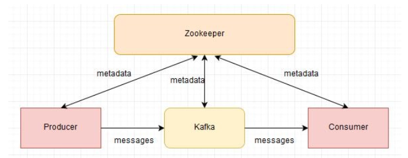
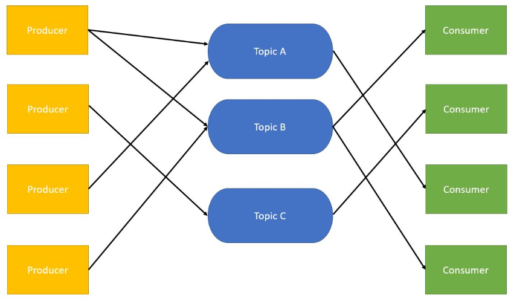
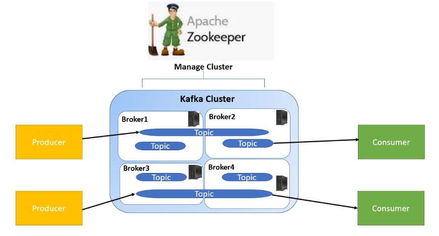

# POC: Apache KAFKA

### Step 1:

Download Apache Kafka

* https://kafka.apache.org/downloads 
* **Version**: `0.10.2.1` **Scala** `2.12`

### Step 2:

**Run Zookeeper**

Start Zookeeper to Manage Kafka Cluster. Kafka installation comes with an inbuilt zookeeper. Zookeeper is mainly used to track status of nodes present in Kafka cluster and also to keep track of Kafka topics, messages, etc.

[C:\kafka_2.12-0.10.2.1>
.\bin\windows\zookeeper-server-start.bat .\config\zookeeper.properties]()

### Step 3:
**Run Kafka Broker**

[C:\kafka_2.12-0.10.2.1>
.\bin\windows\kafka-server-start.bat .\config\server.properties]()

### Step 4:
**Create a Kafka Topic**

Create a topic with name {variable}, that has only {variable} partition & {variable} replica.

[C:\kafka_2.12-0.10.2.1>
.\bin\windows\kafka-topics.bat --create --topic osl_03 --zookeeper localhost:2181 --replication-factor 1 --partitions 1]()

### Step 5:
* Checkout repository
* $ mvn clean install
* $ mvn spring-boot:run 
* GET API http://localhost:8080/kafka/produce?message={} to send message by producer to kafka broker 
* Retrive http://localhost:8080/kafka/messages messages from the TOPIC

## POC: Apache KAFKA 

Apache Kafka is a high throughput distributed messaging streaming system for handling real-time  large amount data feeds. Apache Kafka is an open-source stream-processing software platform developed by LinkedIn.

#### Advantage
- High Throughput
- Scalability
- Fault Tolerance
- Durability

#### Apache Kafka Topic
Apache Kafka is a messaging system where messages are sent by producers and these messages are consumed by one or more consumers. Producers send the messages to Apache Kafka Topics. From the topics these messages are then consumed by the consumers. Topics have unique names which are used by producers and consumers for sending/consuming messages.

#### Apache Kafka Broker
The physical/virtual machines or servers where topics reside are called brokers. Kafka Broker is a software process that runs on machine.

#### Apache Zookeeper
To manage the cluster we make use of Apache Zookeeper. Apache Zookeeper is a coordination service for distributed application that enables synchronization across a cluster. Zookeeper can be viewed as centralized repository where distributed applications can put data and get data out of it.

